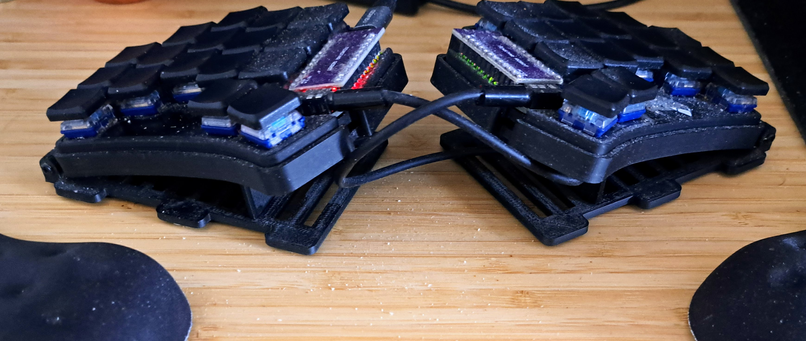

# Keyboard Layout Design Philosophy

## Overview

This document describes the design philosophy, hardware choices, and principles behind this custom
keyboard layout. The layout is optimized for comfort, speed, and minimal finger movement while
maintaining ergonomic positioning.

## Hardware Setup

### Keyboard: Ferris Sweep

The [Ferris Sweep](https://keebmaker.com/products/ferris-sweep) is a 34-key split keyboard
featuring:

- **Minimal key count** (34 keys total, 17 per hand, but inner columns unused, effectively 14 per
  hand)
- **Aggressive columnar stagger** for natural finger alignment
- **Compact footprint** - minimal hand/wrist movement required

### Key Switches: Kailh Choc Light Blue (gChoc)

**Specifications:**

- **Actuation Force**: 20gf (gram-force)
- **Type**: Linear
- **Status**: Discontinued at splitkb.com
- **Also Known As**: "gChoc"

**Why These Switches:**

- ✅ **Extremely light** - Minimal finger fatigue during long typing sessions
- ✅ **Excellent for vertical combos** - Light actuation enables base keys on bottom row
- ✅ **Fast activation** - Quick response without bottoming out
- ✅ **Enables aggressive combo usage** - Can press vertical combos (like `k` on bottom row)
  comfortably

The light actuation force is critical for this layout, as it relies heavily on:

- Vertical combos for additional keys
- Quick finger movements between layers
- Extended typing sessions without fatigue

### Physical Positioning

**Tent Angle:** 10 degrees

- Hands slope inward naturally
- Reduces ulnar deviation
- More comfortable wrist position

**Negative Tilt:** -10 degrees

- Keyboard slopes away from body
- Wrists stay neutral (not extended upward)
- Prevents wrist strain during long sessions

**Wrist Rests:** Used

- Maintains neutral wrist position
- Prevents floating wrists
- Reduces arm/shoulder tension

**Result:**

- ✅ Very comfortable for long typing sessions (8+ hours)
- ✅ Minimal strain on wrists, arms, shoulders
- ✅ Natural hand positioning
- ✅ Reduced risk of RSI



## Layout Design Principles

### 1. Minimize Finger Movement

**Primary Goal:** Comfort and speed through minimal travel distance

**Home Row Focus:**

- Fingers rest on home row (s, c, n, t | a, e, i, h)
- Most common letters accessible without leaving home position
- Follows frequency-optimized letter placement

**Movement Hierarchy:**

1. **Home row** - Optimal (no movement)
2. **Bottom row** - Preferred (small downward curl)
3. **Top row** - Acceptable (small upward stretch)
4. **Inner columns** - Not used at all

**Bottom Row Preference:**

- Easier to curl fingers down than stretch up
- More comfortable for sustained typing
- Used for important keys: shift, common consonants

### 2. Top Row Usage Strategy

**General Principle:** Minimize top row usage due to finger stretch

**Exceptions:**

- ✅ **Middle finger** - Comfortable reach to top row
- ✅ **Ring finger** - Acceptable reach to top row
- ❌ **Pinky finger** - Avoid unless combo
- ❌ **Index finger** - Avoid unless combo

**Combo Strategy:**

- Top row + middle row combos are comfortable for index finger
- Top row + middle row combos possible for pinky finger
- This expands usable keys without sacrificing comfort

**Example:** The letter `t` on home row (left index) can combo with top row for `v` comfortably.

### 3. Inner Columns

**Strategy:** Not used at all

**Rationale:**

- Awkward finger extension required
- Breaks hand symmetry
- High error rate
- Better to use layers or combos

**Alternative:** Use layers, combos, or magic keys instead

### 4. Movement Preferences

**Preferred Movement Types:**

1. **Rolls** (sequential keys, same hand)
    - Example: "you"
    - Fluid motion, minimal effort
    - Fast and comfortable

2. **Alternating hands**
    - Example: "make", "work"
    - Each hand rests while other types
    - Reduces fatigue

3. **Inward rolls** (slightly preferred)
    - Fingers move toward center
    - Feels more natural than outward
    - Example: pinky → ring → middle

**Avoided Patterns:**

❌ **Same Finger Bigrams (SFB)**

- Pressing two keys with same finger consecutively
- Slow and uncomfortable
- Example: "ed", "un" on same finger

❌ **Scissors**

- Two fingers moving in opposite directions
- Awkward and slow
- Example: index + pinky moving apart

### 5. Magic Keys Integration

**Concept:** Keys that adapt based on previously typed character

**Example:** Letter `n` followed by "magic A" outputs "ng"

- Both `n` and `g` would normally be a same finger bigram (SFB), because they are both on middle finger
- Magic key transforms this into efficient typing
- Maintains speed while optimizing layout

**Trade-off:**

- ❌ Harder to learn (requires memorization)
- ✅ Significantly improves typing speed and comfort
- ✅ Reduces physical finger movement

**Other Magic Key Functions:**

- Complete common bigrams ("er", "ing", "ion")
- Add suffixes to words
- Context-aware output

See [Magic Keys section in README](README.md#magic-keys) for complete list.

### 6. Layer System

**Philosophy:** Keep base layer clean, use layers for less frequent keys

**Base Layer:**

- All letters
- Common punctuation
- Space
- Shift keys (both pinkies)
- Layer activation keys

**Secondary Layers:**

1. **Nav Layer** - Navigation and shortcuts
    - Arrow keys
    - Enter, Backspace, Delete
    - Home, End, Page Up/Down
    - Copy, paste, cut
    - Window/tab switching

2. **FnSym Layer** - Symbols and function keys
    - Symbols (!, @, #, etc.)
    - Function keys (F1-F12)
    - Brackets, quotes

3. **Num Layer** (Tri-layer) - Number pad
    - Activated when both right shift and FnSym active
    - Dedicated number entry

4. **Specialized Layers:**
    - Case conversion layer
    - Media keys layer


| Decimals   | Number Layer | FN Sym Layer |
|------------|--------------|--------------|
| Home row   | 4 3 2 1      | F4 F3 F2 F1  |
| Bottom row | 8 7 6 5      | F8 F7 F6 F5  |
| Top row    | , 9          | F10 F9       |
| Left thumb | . 0          | F12 F11      |

**Benefits:**

- ✅ Base layer stays simple and fast
- ✅ Everything accessible within 1-2 key presses
- ✅ No cognitive overload
- ✅ Fingers stay in home position

### 7. Avoiding Timing Issues

**Problem:** Home row mods introduce timing ambiguity

- Is it a tap or hold?
- Requires tuning timing thresholds
- Can cause accidental modifier activation when typing fast
- Slows down typing

**Solution:** No home row mods on base layer

**Base Layer Modifiers:**

- **Shift** - Both pinky fingers (bottom row)
- **Other modifiers** - Available when shift is held

**Shift Key Strategy for Base Layer:**

When LEFT or RIGHT shift is held:

- **Pinky**: Activates shift
- **Ring finger**: Alt (deactivates shift)
- **Middle finger**: Ctrl (deactivates shift)
- **Index finger**: Shift (for Alt+Shift combinations)

**Example Modifier Combinations:**

Note: All modifier keys are in bottom row

- A: Hold left pinky (shift) + index (a)
- T: Hold right pinky (shift) + index (t)
- Ctrl-a: Hold left pinky (shift) + middle (ctrl) + index (a)
- Alt+Shift-a: Hold left pinky (shift) + ring (alt) + index (shift)
- Ctrl+Shift: Hold pinky (shift) + middle (ctrl) + index (shift)

**Benefits:**

- ✅ No timing ambiguity
- ✅ Fast, predictable behavior
- ✅ All modifier combinations possible
- ✅ Alt+Shift combos work naturally

**Other Layers:** Can use home row mods

- Less frequently accessed
- Timing less critical
- More keys available per layer

### 8. Chord System

The chord system is extensively documented in [CHORD_MODE.md](CHORD_MODE.md).

**Key Integration:**

- Chord activation key on home row (easy access)
- 220+ words available via 2-letter chords
- Reduces keystrokes by 50-80% for common words
- Works seamlessly with other layout features

**Design Consideration:**

- Chord sequences use "good second letters" (easy to reach)
- Follows same movement optimization principles
- Can be combined with capitalization and suffixes

## Design Process

### Starting Point

**Base Layout:** [Hands Down](https://sites.google.com/alanreiser.com/handsdown) - Vibranium variant (adapted to avoid inner columns)

**Why Hands Down:**

- ✅ Optimized for English language frequency
- ✅ Excellent SFB and scissors metrics
- ✅ Good rolls and alternating hand balance
- ✅ Proven comfort in long-term use
- ✅ Active community and resources

**Modifications:**

- Adjusted for magic key integration
- Optimized for chord system
- Added layer-specific customizations
- Integrated combos for 34-key layout

### Development Approach

**Challenge:** Writing QMK layouts manually is extremely difficult

- Complex key mappings
- Combo definitions
- Layer interactions
- Easy to make errors

**Solution:** Layout Generator

**Generator Characteristics:**

- **Language:** Kotlin
- **Input:** README.md (human-readable layout description)
- **Output:** QMK firmware files
- **Validation:** Lots of automated checks

**Why a Generator:**

- ✅ Single source of truth (README.md)
- ✅ Easy to modify layout
- ✅ Automatic code generation
- ✅ Reduces errors
- ✅ Documentation and implementation stay in sync

**Generator Code:**

- Located in `src/main/kotlin/`
- Not heavily documented
- Not well structured (evolved organically)
- Works reliably for this specific layout

**Note:** If building your own layout, consider:

- Using the generator as inspiration
- Having AI generate a new generator tailored to your needs
- The generator approach is highly recommended over manual QMK coding

### Build System

**Build Tools:**

- [mise](https://mise.jdx.dev/) - Development environment management
- Maven - Build automation for Kotlin generator

**Build Process:**

```bash
# Build and flash keyboard
mise run flash
```

**Workflow:**

1. Edit layout in README.md
2. Run generator
3. Verify generated files (combos, chords, layout)
4. Flash to keyboard
5. Test and iterate

## Key Design Decisions

### 1. Why 34 Keys?

**Advantages:**

- ✅ Forces efficient layer usage
- ✅ Minimal hand/wrist movement
- ✅ No awkward outer column reaches
- ✅ Everything within comfortable range

**Trade-offs:**

- ❌ Requires more layers
- ❌ Steeper learning curve
- ✅ Better long-term comfort
- ✅ Faster once learned

### 2. Why gChoc (20gf) Switches?

**Rationale:**

- Enables vertical combos with minimal effort
- Reduces finger fatigue dramatically
- Supports aggressive combo-based layout
- Fast activation for layer switching

**Consideration:**

- May feel "too light" initially
- Risk of accidental key presses when learning
- Requires adjustment period
- Long-term comfort benefits outweigh initial challenge

### 3. Why No Home Row Mods on Base?

**Problem with HRM:**

- Timing ambiguity (tap vs. hold)
- Slows down fast typing
- Requires extensive tuning
- Can cause frustration

**Alternative Approach:**

- Dedicated shift keys (pinky bottom row)
- Other mods available when shift held
- No timing issues
- Predictable behavior
- Better for fast typing

### 4. Why Magic Keys?

**Problem:** Limited keys on 34-key board

**Solution:** Context-aware keys that adapt

- Reduces need for additional keys
- Maintains common bigrams
- Optimizes finger movement
- Enables better letter placement

**Example:**

- `n` + magic A → "ng"
- `t` + magic B → "ing"
- `s` + magic A → "ion"

**Trade-off:**

- Requires learning and memorization
- Harder for newcomers
- Significantly better once mastered

### 5. Why Generator-Based Layout?

**Manual QMK Problems:**

- Extremely error-prone
- Difficult to maintain
- Hard to document
- Changes are risky

**Generator Benefits:**

- Documentation IS the source code
- Easy to modify and iterate
- Automatic validation
- Reduces cognitive load

**Philosophy:**

- Layout complexity should not be in code
- Code should be generated from high-level description
- Makes iteration faster and safer

## Typing Characteristics

### Finger Usage Distribution

**Left Hand:**

- Pinky: Low usage (shift, escape, special)
- Ring: Medium usage (s, x, f)
- Middle: High usage (c, w, l, n)
- Index: High usage (t, v, d, r)

**Right Hand:**

- Index: High usage (a, u, space)
- Middle: High usage (e, o)
- Ring: High usage (i, y)
- Pinky: Medium usage (h, shift, special)

**Balance:** Relatively balanced between hands (~50/50)

### Common Patterns

**Fast Rolls:**

- "the" - alternating hands, very fast
- "ion" - magic key sequence
- "ing" - magic key sequence

**Common Bigrams:**

- Most on different fingers
- SFBs minimized through magic keys
- Comfortable hand alternation

### Speed Characteristics

**Strengths:**

- Very fast for common English text
- Excellent for prose writing
- Good for programming (with layers)
- Efficient for editing (nav layer)

**Learning Curve:**

- Initial: Steep (magic keys, layers, chords)
- Intermediate: Rapid improvement
- Advanced: Excellent speed and comfort

## Comfort Analysis

### Long-Term Comfort

**Positive Factors:**

- ✅ Minimal finger travel
- ✅ No awkward stretches
- ✅ Light switch actuation
- ✅ Ergonomic hand positioning
- ✅ Frequent hand alternation
- ✅ Good rolls

**Result:** Can type comfortably for 8+ hours

### Fatigue Resistance

**Design Features:**

- Light switches (20gf) reduce fatigue
- Bottom row preference (easier than stretching)
- Hand alternation gives fingers rest
- No timing pressure (no HRM on base)
- Efficient movement patterns

### Injury Prevention

**Ergonomic Factors:**

- Neutral wrist position (tent + negative tilt)
- Minimal ulnar deviation
- No awkward finger extensions
- Reduced repetitive strain
- Wrist support used

## Adaptability

### For Different Use Cases

**Prose Writing:** ⭐⭐⭐⭐⭐

- Optimized for English
- Fast common words via chords
- Excellent comfort

**Programming:** ⭐⭐⭐⭐☆

- Good symbol access (FnSym layer)
- Programming chords available
- May require minor adjustments

**Data Entry:** ⭐⭐⭐☆☆

- Number layer is efficient
- Not optimized for pure numeric entry
- Consider external numpad for heavy use

**Shortcuts:** ⭐⭐⭐⭐⭐

- Dedicated shortcuts on Nav layer
- Window/tab switching built-in
- Fast access to copy/paste

### Customization

**Easy to Modify:**

- Edit README.md
- Regenerate files
- Flash keyboard
- Iterate quickly

**Common Modifications:**

- Adjust combo keys
- Change magic key mappings
- Add/remove chords
- Customize layer content

## Learning Path

### Stage 1: Basic Typing (Week 1-2)

- Learn letter positions
- Get comfortable with layers
- Slow, deliberate typing
- **Goal:** 20-30 WPM

### Stage 2: Magic Keys (Week 3-4)

- Learn common magic key combinations
- Start using chords for very common words
- Build muscle memory
- **Goal:** 40-50 WPM

### Stage 3: Optimization (Month 2-3)

- Master all magic keys
- Expand chord usage
- Optimize personal workflow
- **Goal:** 60-80 WPM

### Stage 4: Mastery (Month 4+)

- Automatic typing (no thinking)
- Full chord vocabulary
- Personalized customizations
- **Goal:** 80-120+ WPM with excellent comfort

## Comparison with Standard Layouts

### vs. QWERTY

| Aspect          | This Layout | QWERTY        |
|-----------------|-------------|---------------|
| Finger Movement | Minimal     | High          |
| SFB Frequency   | Very Low    | High          |
| Comfort (8h+)   | Excellent   | Poor          |
| Learning Curve  | Steep       | None          |
| Speed Potential | Very High   | Moderate      |
| Ergonomics      | Optimized   | Not optimized |

### vs. Dvorak/Colemak

| Aspect        | This Layout | Dvorak/Colemak |
|---------------|-------------|----------------|
| Key Count     | 34          | Usually 60+    |
| Layers        | Essential   | Optional       |
| Customization | Extensive   | Moderate       |
| Magic Keys    | Yes         | No             |
| Chords        | Yes         | No             |
| Optimization  | Extreme     | Good           |

### vs. Other 34-Key Layouts

| Aspect        | This Layout        | Others          |
|---------------|--------------------|-----------------|
| Magic Keys    | Yes                | Rare            |
| Chord System  | 220+ words         | Usually none    |
| Combos        | Extensive          | Varies          |
| Base Row Mods | No (design choice) | Often yes       |
| Negative Tilt | Yes                | Varies          |
| Switch Weight | 20gf               | Usually heavier |

## Philosophy Summary

This keyboard layout embodies several core principles:

1. **Comfort First** - Every decision optimized for long-term typing comfort
2. **Efficiency Through Layers** - Embrace layers rather than fight them
3. **Smart Automation** - Use magic keys and chords to reduce keystrokes
4. **Ergonomics Matter** - Physical setup is as important as logical layout
5. **Generator-Driven** - Complexity in description, simplicity in generation
6. **Iterative Refinement** - Easy to modify and improve over time

The result is a layout that:

- ✅ Types faster (once learned)
- ✅ Feels more comfortable
- ✅ Causes less fatigue
- ✅ Reduces RSI risk
- ✅ Supports long typing sessions
- ✅ Adapts to individual needs

## Resources

- [Hands Down Layout](https://sites.google.com/alanreiser.com/handsdown) - Base layout inspiration
- [Ferris Sweep](https://keebmaker.com/products/ferris-sweep) - Hardware keyboard
- [QMK Firmware](https://docs.qmk.fm/) - Firmware platform
- [Chord Mode Documentation](CHORD_MODE.md) - Complete chord system guide
- [README.md](README.md) - Layout definition and generator source

## Credits

- **Hands Down Layout** by Alan Reiser - Base letter placement
- **QMK Firmware** - Keyboard firmware platform
- **Ferris Sweep** by Pierre Chevalier - Keyboard design
- **Community** - Various optimization ideas and feedback

---

**Version**: 1.0  
**Date**: January 2026  
**Author**: Gregor Zeitlinger  
**Status**: Living document - continuously refined based on usage

