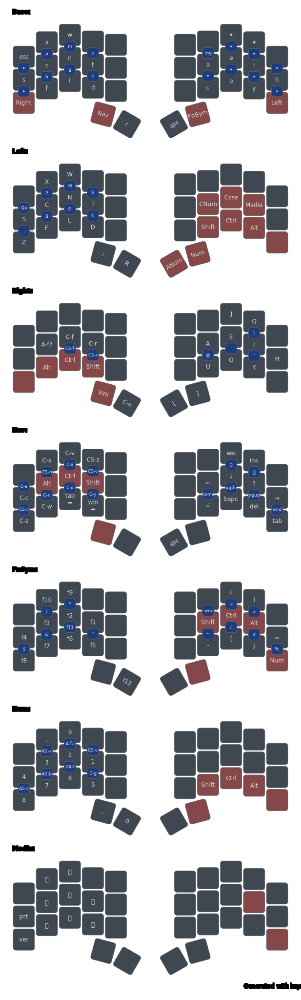

# Magic Keyboard Layout

A 34-key layout for the [Ferris Sweep](https://keebmaker.com/products/ferris-sweep), built on the
**Hands Down Vibranium** base letter layout. What sets it apart is two families of context-aware
keys:

- **Magic keys** — one key that emits different output depending on the key pressed *before* it: a
  letter, a whole word, or a suffix. Eleven keys × the ~26 letters that can precede them (27 with
  space) is room for getting on for 300 expansions — about half filled so far.
- **Adaptive keys** — common letter pairs that automatically rewrite themselves into a more
  comfortable motion (e.g. `n` then `r` → `ng`), with no extra keypress.

📖 The whole story — why this layout exists and how you'd start your own — is in the blog post:
[**The Secret World of Keyboard Wizardry**](blog/2026-06-13-magic-keyboard.md).

> **The entire layout — keymap, combos, magic keys, adaptive keys — is generated from the tables in
> this file.** `README.md` is the single source of truth: the Kotlin generator in
> `src/main/kotlin/` reads these tables and emits the QMK firmware under `qmk/`. Edit the tables
> here, never the generated code. See [Generator](#generator).

## Credits

- [Hands Down Keyboard Layout](https://sites.google.com/alanreiser.com/handsdown)
- [The T-34 keyboard layout](https://www.jonashietala.se/blog/2021/06/03/the-t-34-keyboard-layout/)
- [X-Case](https://github.com/andrewjrae/kyria-keymap#x-case)

## Features

- **Magic keys** - common words/phrases from one letter + a magic key (~300 expansions). See [Magic Keys](#magic-keys).
- **Adaptive keys** - awkward letter pairs rewrite themselves automatically. See [Adaptive keys](#adaptive-keys).
- **[Design Philosophy](DESIGN_PHILOSOPHY.md)** - the hardware, ergonomics, and design principles behind this layout.
- **Home Row Mods** - modifiers on the home row for ergonomic access.
- **Window/Tab Switching** - fast application and tab switching.
- **X-Case** - multiple case conversion modes (camelCase, snake_case, etc.).

## Overview

*Rendered from the tables below with [keymap-drawer](https://github.com/caksoylar/keymap-drawer);
regenerate with `mise run generate`.*

## Reading the layout

How to read this layout:

- 💎 = combo key (e.g. middle and index finger in top row pressed together produce "b")
  - 💎L means the combo key has to be pressed last
- 🛑 = key can't be used because the layer was activated with that key or because it's reserved for a
  modifier
- empty = use key from base layer
- FnSym = capitalized words are layer names - if they are a key, the layer is activated as toggled
  or one shot layer (if the "OneShot" flag is set in the layer flags)
- \*Mouse = layer is active while key is held
- C-w = Ctrl-w (same for Alt and Shift)
- f12+Num = tab-mod - f12 on tap and Num on hold
- "that" = combo that produces "that"
- #g = exact symbol token; `#...` entries must exist in the Symbols table
- [ { = { is the shifted key of [, so it's used when Shift is held (only for information)
- The symbol table at the bottom shows the meaning of the symbols used in the layout.

Currently unused features:

- /+Ctrl = tab-mod - / on tab and CTRL on hold
- $Mouse = layer is active while key is held (double tap to lock layer)
- @Num = layer is active for the next keypress
- Sym/Nav = layer is active for the next keypress:
  If the activation key is still down when the next key is pressed, the Nav layer is used, otherwise
  the Sym layer is used

> **Note**: The layout is generated from this file directly.

## Layout

| Layer | L. Pin. | L. Ring | L. Mid. | L. Ind. | R. Ind. | R. Mid. | R. Ring | R. Pin. |
| :---: | :-----: | :-----: | :-----: | :-----: | :-----: | :-----: | :-----: | :-----: |
| Base  |   esc   |    x    |    w    |  dead3  |  dead2  | magic_a | magic_b |  dead1  |
| Base  |    s    |    c    |    n    |    t    |    a    |    e    |    i    |    h    |
| Base  | \*Right |    f    |    l    |    d    |    u    |    o    |    y    | \*Left  |
| Base  |         |         |  \*Nav  |    r    |   spc   | \*FnSym |         |         |
|       | ------- | ------- | ------- | ------- | ------- | ------- | ------- | ------- |
| Base  |         |   ?↩️️   |  "wl"   |         |         |         |         |         |
| Base  |    '    |    .    |    ,    |  bspc   |  "aa"   |  "eu"   |         |         |
| Base  |   🛑    |    ?    |    "    |   ↩️️    |  "uh"   |  "oe"   |         |   💎L   |
| Base  |         |         |         |    j    |    q    |         |         |         |
|       | ------- | ------- | ------- | ------- | ------- | ------- | ------- | ------- |
| Base  |         |         |         |         |         |         |         |         |
| Base  |         |         |    ß    |    ä    |  "ae"   |  "eh"   | "I'm "  |  "hy"   |
| Base  |   💎L   |         |    ö    |    ü    | "only " |  "oh"   |  "yr"   |   🛑    |
| Base  |         |         |         |  "qu"   |    z    |         |         |         |
|       | ------- | ------- | ------- | ------- | ------- | ------- | ------- | ------- |
| Base  |         |         |         |    v    |   ing   |         |         |         |
| Base  |         |         |         |   💎    |   💎    |         |         |         |
| Base  |         |         |         |    k    | magic_h |         |         |         |
| Base  |         |         |         |         |         |         |         |         |
|       | ------- | ------- | ------- | ------- | ------- | ------- | ------- | ------- |
| Base  |         |         |    m    |         |         | magic_d |         |         |
| Base  |         |         |   💎    |         |         |   💎    |         |         |
| Base  |         |         |    g    |         |         | magic_i |         |         |
| Base  |         |         |         |         |         |         |         |         |
|       | ------- | ------- | ------- | ------- | ------- | ------- | ------- | ------- |
| Base  |         |    p    |         |         |         |         | magic_e |         |
| Base  |         |   💎    |         |         |         |         |   💎    |         |
| Base  |         |    b    |         |         |         |         | magic_j |         |
| Base  |         |         |         |         |         |         |         |         |
|       | ------- | ------- | ------- | ------- | ------- | ------- | ------- | ------- |
| Base  | magic_c |         |         |         |         |         |         | magic_f |
| Base  |   💎    |         |         |         |         |         |         |   💎    |
| Base  | magic_g |         |         |         |         |         |         | magic_k |
| Base  |         |         |         |         |         |         |         |         |
|       | ------- | ------- | ------- | ------- | ------- | ------- | ------- | ------- |
| Right |         |         |         |         |  dead3  |    J    |    Q    |         |
| Right |         |  CS-c   |   C-f   |   C-r   |         |         |         |         |
| Right |   🛑    |   🛑    |   🛑    |   🛑    |         |         |         |   \_    |
| Right |         |         |  \*Vim  |   C-n   |    [    |    ]    |         |         |
|       | ------- | ------- | ------- | ------- | ------- | ------- | ------- | ------- |
| Right |         |         |         |         |         |         |         |         |
| Right |         |         |         |   💎    |   💎    |         |         |         |
| Right |         |         |         |  CS-r   |    @    |         |         |         |
| Right |         |         |         |         |         |         |         |         |
|       | ------- | ------- | ------- | ------- | ------- | ------- | ------- | ------- |
| Right |         |         |         |         |         |         |         |         |
| Right |         |         |   💎    |         |         |   💎    |         |         |
| Right |         |         |  CS-f   |         |         |    !    |         |         |
| Right |         |         |         |         |         |         |         |         |
|       | ------- | ------- | ------- | ------- | ------- | ------- | ------- | ------- |
| Right |         |         |         |         |         |         |    \    |         |
| Right |         |         |         |         |         |         |   💎    |         |
| Right |         |         |         |         |         |         |    `    |         |
| Right |         |         |         |         |         |         |         |         |
|       | ------- | ------- | ------- | ------- | ------- | ------- | ------- | ------- |
| RMods |         |         |         |         |         |    j    |    q    |         |
| RMods |         |         |         |         |         |         |         |         |
| RMods |   🛑    |   🛑    |   🛑    |   🛑    |         |         |         |         |
| RMods |         |         |         |         |    [    |    ]    |         |         |
|       | ------- | ------- | ------- | ------- | ------- | ------- | ------- | ------- |
| Left  |         |         |         |         |  dead1  |         |         |         |
| Left  |         |         |         |         | \*CNum  | \*Case  | \*Media |         |
| Left  |    Z    |         |         |         |   🛑    |   🛑    |   🛑    |   🛑    |
| Left  |         |         |    :    |         | \*ANum  |  \*Num  |         |         |
|       | ------- | ------- | ------- | ------- | ------- | ------- | ------- | ------- |
| Left  |  "Qu"   |         |         |         |         |         |         |         |
| Left  |   💎    |         |         |         |         |         |         |         |
| Left  |    ;    |         |         |         |         |         |         |         |
| Left  |         |         |         |         |         |         |         |         |
|       | ------- | ------- | ------- | ------- | ------- | ------- | ------- | ------- |
| LMods |         |         |         |         |         |         |         |         |
| LMods |         |         |         |         |         |         |         |         |
| LMods |    z    |         |         |         |   🛑    |   🛑    |   🛑    |   🛑    |
| LMods |         |         |         |         |         |         |         |         |
|       | ------- | ------- | ------- | ------- | ------- | ------- | ------- | ------- |
| FnSym |  dead2  |   f10   |   f9    |  dead2  |  dead3  |    (    |    )    |  dead1  |
| FnSym |   f4    |   f3    |   f2    |   f1    |   🛑    |   🛑    |   🛑    |    =    |
| FnSym |   f8    |   f7    |   f6    |   f5    |    -    |    {    |    }    |  \*Num  |
| FnSym |         |         |         |   f12   |   🛑    |   🛑    |         |         |
|       | ------- | ------- | ------- | ------- | ------- | ------- | ------- | ------- |
| FnSym |         |         |         |         |   win   |         |         |         |
| FnSym |         |         |         |   💎    |   💎    |         |         |         |
| FnSym |         |         |         |    ^    |    ~    |         |         |         |
| FnSym |         |         |         |         |         |         |         |         |
|       | ------- | ------- | ------- | ------- | ------- | ------- | ------- | ------- |
| FnSym |         |         |   \*    |         |         |    <    |         |         |
| FnSym |         |         |   💎    |         |         |   💎    |         |         |
| FnSym |         |         |   f11   |         |         |    /    |         |         |
| FnSym |         |         |         |         |         |         |         |         |
|       | ------- | ------- | ------- | ------- | ------- | ------- | ------- | ------- |
| FnSym |         |  pipe   |         |         |         |         |    >    |         |
| FnSym |         |   💎    |         |         |         |         |   💎    |         |
| FnSym |         |    &    |         |         |         |         |    #    |         |
| FnSym |         |         |         |         |         |         |         |         |
|       | ------- | ------- | ------- | ------- | ------- | ------- | ------- | ------- |
| FnSym |         |         |         |         |         |         |         |         |
| FnSym |   💎    |         |         |         |         |         |         |   💎    |
| FnSym |    $    |         |         |         |         |         |         |    %    |
| FnSym |         |         |         |         |         |         |         |         |
|       | ------- | ------- | ------- | ------- | ------- | ------- | ------- | ------- |
|  Nav  |  dead3  |   C-x   |   C-v   |  CS-z   |  dead1  |   esc   |   ins   |  dead2  |
|  Nav  |   C-c   |   🛑    |   🛑    |   🛑    |   ⬅️    |   ⬇️    |   ⬆️    |   ➡️    |
|  Nav  |   C-z   |   C-w   | tab ➡️  | win ➡️  |   ↩️️    |  bspc   |   del   |   tab   |
|  Nav  |         |         |   🛑    |   🛑    |   spc   |         |         |         |
|       | ------- | ------- | ------- | ------- | ------- | ------- | ------- | ------- |
|  Nav  |         |         |         |  CS-v   |         |         |         |         |
|  Nav  |         |         |         |   💎    |   💎    |         |         |         |
|  Nav  |         |         |         |   C-y   |  ⬅️⬅️   |         |         |         |
|  Nav  |         |         |         |         |         |         |         |         |
|       | ------- | ------- | ------- | ------- | ------- | ------- | ------- | ------- |
|  Nav  |         |         |   C-a   |         |         |   ➕    |         |         |
|  Nav  |         |         |   💎    |         |         |   💎    |         |         |
|  Nav  |         |         |   C-d   |         |         |  ⬇️⬇️   |         |         |
|  Nav  |         |         |         |         |         |         |         |         |
|       | ------- | ------- | ------- | ------- | ------- | ------- | ------- | ------- |
|  Nav  |         |  CS-n   |         |         |         |         |   ➖    |         |
|  Nav  |         |   💎    |         |         |         |         |   💎    |         |
|  Nav  |         |   C-k   |         |         |         |         |  ⬆️⬆️   |         |
|  Nav  |         |         |         |         |         |         |         |         |
|       | ------- | ------- | ------- | ------- | ------- | ------- | ------- | ------- |
|  Nav  |   C-e   |         |         |         |         |         |         |         |
|  Nav  |   💎    |         |         |         |         |         |         |   💎    |
|  Nav  |  A-f7   |         |         |         |         |         |         |  ➡️➡️   |
|  Nav  |         |         |         |         |         |         |         |         |
|       | ------- | ------- | ------- | ------- | ------- | ------- | ------- | ------- |
|  Nav  |         |         |         |         |         |         |         |         |
|  Nav  |         |         |         |         |  CA-b   |   💎    |  A-f12  |         |
|  Nav  |         |         |         |         |         |         |         |         |
|  Nav  |         |         |         |         |         |         |         |         |
|       | ------- | ------- | ------- | ------- | ------- | ------- | ------- | ------- |
|  Nav  |         |         |         |         |         |         |         |         |
|  Nav  |         |         |         |         |   C-b   |         |   💎    |         |
|  Nav  |         |         |         |         |         |         |         |         |
|  Nav  |         |         |         |         |         |         |         |         |
|       | ------- | ------- | ------- | ------- | ------- | ------- | ------- | ------- |
|  Nav  |         |         |         |         |         |         |         |         |
|  Nav  |         |         |         |         |         |         |         |         |
|  Nav  |         |         |         |         |  C-f12  |   💎    |   C-/   |         |
|  Nav  |         |         |         |         |         |         |         |         |
|       | ------- | ------- | ------- | ------- | ------- | ------- | ------- | ------- |
|  Nav  |         |         |         |         |         |         |         |         |
|  Nav  |         |         |         |         |         |         |         |         |
|  Nav  |         |         |         |         |   C-p   |         |   💎    |         |
|  Nav  |         |         |         |         |         |         |         |         |
|       | ------- | ------- | ------- | ------- | ------- | ------- | ------- | ------- |
|  Vim  |         |         |         |         |         |         |         |         |
|  Vim  |         |         |         |         |    h    |    j    |    k    |    l    |
|  Vim  |         |         |         |         |         |         |         |         |
|  Vim  |         |         |         |         |         |         |         |         |
|       | ------- | ------- | ------- | ------- | ------- | ------- | ------- | ------- |
|  Num  |  dead1  |    ,    |    9    |  dead2  |         |         |         |         |
|  Num  |    4    |    3    |    2    |    1    |         |         |         |         |
|  Num  |    8    |    7    |    6    |    5    |         |         |         |         |
|  Num  |         |         |    .    |    0    |   🛑    |   🛑    |         |         |
|       | ------- | ------- | ------- | ------- | ------- | ------- | ------- | ------- |
|  Num  |         |         |         |  CS-v   |         |         |         |         |
|  Num  |         |         |         |   💎    |         |         |         |         |
|  Num  |         |         |         |   C-g   |         |         |         |         |
|  Num  |         |         |         |         |         |         |         |         |
|       | ------- | ------- | ------- | ------- | ------- | ------- | ------- | ------- |
|  Num  |         |         |  A-f1   |         |         |         |         |         |
|  Num  |         |         |   💎    |         |         |         |         |         |
|  Num  |         |         |  CA-l   |         |         |         |         |         |
|  Num  |         |         |         |         |         |         |         |         |
|       | ------- | ------- | ------- | ------- | ------- | ------- | ------- | ------- |
|  Num  |         |  AS-x   |         |         |         |         |         |         |
|  Num  |         |   💎    |         |         |         |         |         |         |
|  Num  |         |  AS-b   |         |         |         |         |         |         |
|  Num  |         |         |         |         |         |         |         |         |
|       | ------- | ------- | ------- | ------- | ------- | ------- | ------- | ------- |
|  Num  |         |         |         |         |         |         |         |         |
|  Num  |   💎    |         |         |         |         |         |         |         |
|  Num  |  AS-s   |         |         |         |         |         |         |         |
|  Num  |         |         |         |         |         |         |         |         |
|       | ------- | ------- | ------- | ------- | ------- | ------- | ------- | ------- |
| ANum  |         |         |   A-9   |         |         |         |         |         |
| ANum  |   A-4   |   A-3   |   A-2   |   A-1   |         |         |         |         |
| ANum  |   A-8   |   A-7   |   A-6   |   A-5   |         |         |         |         |
| ANum  |         |         |         |   A-0   |   🛑    |   🛑    |         |         |
|       | ------- | ------- | ------- | ------- | ------- | ------- | ------- | ------- |
| CNum  |         |         |   C-9   |         |         |         |         |         |
| CNum  |   C-4   |   C-3   |   C-2   |   C-1   |         |         |         |         |
| CNum  |   C-8   |   C-7   |   C-6   |   C-5   |         |         |         |         |
| CNum  |         |         |         |   C-0   |   🛑    |   🛑    |         |         |
|       | ------- | ------- | ------- | ------- | ------- | ------- | ------- | ------- |
| Media |  dead2  |   🔅    |   🔆    |  dead1  |         |         |         |         |
| Media |   prt   |   🔈    |   🔊    |   🔇    |         |         |         |   🛑    |
| Media |   ver   |   ⏮️    |   ⏭️    |   ⏯️    |         |         |         |         |
| Media |         |         |         |         |         |         |         |         |
|       | ------- | ------- | ------- | ------- | ------- | ------- | ------- | ------- |
| Media |         |         |         |         |         |         |         |         |
| Media |         |         |         |   💎    |         |         |         |         |
| Media |         |         |         |   @gl   |         |         |         |         |
| Media |         |         |         |         |         |         |         |         |
|       | ------- | ------- | ------- | ------- | ------- | ------- | ------- | ------- |
| Media |         |         | "LGTM"  |         |         |         |         |         |
| Media |         |         |   💎    |         |         |         |         |         |
| Media |         |         | @gmail  |         |         |         |         |         |
| Media |         |         |         |         |         |         |         |         |
|       | ------- | ------- | ------- | ------- | ------- | ------- | ------- | ------- |
| Media |         |         |         |         |         |         |         |         |
| Media |         |   💎    |         |         |         |         |         |         |
| Media |         |  @zeit  |         |         |         |         |         |         |
| Media |         |         |         |         |         |         |         |         |
|       | ------- | ------- | ------- | ------- | ------- | ------- | ------- | ------- |
| Case  |         |         |         |         |         |         |         |         |
| Case  | sl/case | PasCase |  CapW   | SN_CASE |         |         |         |         |
| Case  | do.case | camCase | kb-case | sn_case |         |         |         |         |
| Case  |         |         |         |         |         |         |         |         |
|       | ------- | ------- | ------- | ------- | ------- | ------- | ------- | ------- |

## Home Row Mods

On all other layers, the modifiers are as shown in the table below.

| Home Row Modifiers | Finger |
| ------------------ | ------ |
| Alt                | Ring   |
| Ctrl               | Middle |
| Shift              | Index  |

## Window and Tab switching

- win ➡️ and tab ➡️ are used to Short windows and tabs.
- Once you press any of those keys, you're in switcher mode, where all other keys are replaced by
  shift-tab.
- Switcher mode is exited when you go back to the base layer.

## Magic Keys

Rows = preceding key. Columns = the eleven physical magic keys (see the Layout table for their positions).

Cell = what to emit.

- A cell may be prefixed with `⌫` to force `BS + output` when the preceding key
  is replaceable. This is an explicit table-level override and drives the
  generated logic directly.
- Single-char letter cells append or tap unless prefixed with `⌫` (e.g.
  `a` + `e` yields `ae`, while `spc` + `⌫z` yields `z`). If `magic_a`
  has no table match for the preceding key, it falls back to repeating that
  last typed key; repeated presses of `magic_a` keep repeating it.
- Single-char punctuation/symbol cells do `⌫ + char` when the preceding key is
  replaceable (typically a letter or `spc`), so `t` + `.` yields `.`. A
  repeated press of the same magic key then replays just the emitted letter or
  symbol, with no extra backspace. No suffix state.
- Bare words/phrases (unquoted multi-char, e.g. `because`, `thank you`):
  generator auto-appends a trailing space and activates the suffix state
  machine. From there, the next magic press chains the suffix shown in the
  `suffix` row; the `ing` key also works with vowel-drop. `.` exits with
  one-shot shift, `,` exits without shift. Bare words may append, strip the
  repeated prefix letter, or do `⌫ + word`, depending on the preceding key.
- Quoted strings (literal — no auto-space, no suffix state):
  - Preceding key is a letter and cell starts with it → strip prefix. `b` + `"because"` emits `ecause`, yielding `because`.
  - Preceding key is a letter and cell does *not* start with it → `⌫ + cell`.
  - Preceding key is not a letter (spc, punctuation) → append as-is. `,` + `" and "` yields `, and` plus a trailing space.
- Order note: the table is still authored as `preceding key + magic`. Reverse
  order (`magic + following key`) is only a fallback when there is no fresh,
  valid preceding-key interpretation, so forward magics remain authoritative in
  ambiguous sequences. Reverse fallback is limited to replacement cells; append
  and prefix-strip cells still require forward order.
- `[name]` bracket tokens invoke named handlers. `[dotSpc]` = BS + `.` then one-shot shift.
  In the `suffix` row, `[next]` replaces the current word with the next item
  from the `Cycle` table while keeping suffix mode active.
- Row "r" is reserved for future use.  
- Orderded by hand - thumbs last.

| Magic  |  magic_a  |  magic_b   | magic_c  |   magic_d   |    magic_e    |  magic_f   | magic_g |  magic_h   |  magic_i  | magic_j | magic_k |
| :----: | :-------: | :--------: | :------: | :---------: | :-----------: | :--------: | :-----: | :--------: | :-------: | :-----: | :-----: |
| suffix |    ed     |     s      |          |     n't     |       ?       |            |  ", "   |   [next]   |  " the "  |  ". "   |   ly    |
|   b    |  disable  |     h      |          |  possible   | observability |            |         |   become   |  because  |    d    |         |
|   c    |  "'ll "   |   "'s "    |          |   "n't "    |    "'ve "     |   "'d "    |         |     n      |  "'re "   |    d    |         |
|   d    |     f     |     h      |          |    don't    |     does      | difficulty |         |   didn't   |  doesn't  |    c    |         |
|   f    | confusing |     h      |          | performance |    merged     |            |         |  focused   | following |    d    |         |
|   g    |     f     |     t      |          |   suggest   |    change     |            |         |    goes    |     k     |    d    |         |
|   k    |     y     |     h      |          |    think    |   question    |   thanks   |         |   update   |   know    |    x    |         |
|   l    |     r     |     h      |          |  language   |    already    |     b      |         |     n      |     m     |    c    |         |
|   m    |     r     |     h      |          |  implement  |   multiple    |     v      |         | instrument |  "ment"   |    l    |         |
|   n    |     r     |     h      |          |    never    |   anything    |     p      |         | understand |   won't   |    x    |         |
|   p    |     y     |   "ppl"    |          |    apply    |    example    |  explain   |         |     n      |     m     |    d    |         |
|   s    |     r     |  someone   |          |  something  |    support    |  similar   |         |  separate  |  "sion"   |    d    |         |
|   t    |     f     |   though   |          |    just     |    through    |     z      |         |     n      |  "tion"   | thought |         |
|   v    | validate  | everything |          |   improve   |    version    |            |         |   worse    |  resolve  |         |         |
|   w    |  always   |   wasn't   |          |    knew     |   otherwise   |   switch   |         |    why     |     s     |    x    |         |
|   x    |     r     |     h      |          |   except    |   explicit    |  exclude   |         |    exit    |     w     |         |         |
|   a    |           |            |          |             |               |            |         |            |           |         |         |
|   e    |           |            |          |             |               |            |         |            |           |         |         |
|   i    |           |            |          |             |               |            |         |            |           |         |         |
|   h    |           |            |          |             |               |            |         |            |           |         |         |
|   u    |           |            |          |             |               |            |         |            |           |         |         |
|   o    |           |            |          |             |               |            |         |            |           |         |         |
|   y    |           |            |          |             |               |            |         |            |           |         |         |
|  tab   |           |            |          |             |               |            |         |    and     |    the    |         |         |
| enter  |           |            |          |             |               |            |         |    and     |    the    |         |         |
|   ,    |           |            |          |             |               |            |         |  " and "   |  " but "  |         |         |
|  spc   |           |            | [dotSpc] |             |               |            |         |    and     |    the    |         |         |
|   r    |  migrate  |  address   |          |  generate   |   probably    | important  |         |  approval  |           |    x    |         |

## Adaptive keys

| Adaptives |  Key  | Output |
| :-------: | :---: | :----: |
|     a     |   e   |   u    |
|     b     |   d   |   s    |
|     b     |   h   |   b    |
|     c     |   d   |   c    |
|     c     |   n   |   k    |
|     d     |   c   |   v    |
|     d     |   f   |   d    |
|     d     |   h   |   g    |
|     e     |   h   |   e    |
|     e     |   u   |   o    |
|     f     |   d   |   f    |
|     f     |   h   |   s    |
|     g     |   d   |   n    |
|     g     |   f   |   l    |
|     g     |   t   |   g    |
|     k     |   h   |   n    |
|     k     |   y   |   t    |
|     l     |   b   |   w    |
|     l     |   h   |   p    |
|     l     |   r   |   l    |
|     m     |   h   |   m    |
|     m     |   r   |   pl   |
|     m     |   t   |   b    |
|     m     |   v   |   t    |
|     n     |   h   |   n    |
|     n     |   p   |   k    |
|     n     |   r   |   g    |
|     n     |   x   |   l    |
|     o     |   h   |   o    |
|     p     |   d   |   l    |
|     p     |   n   |   p    |
|     p     |   y   |   s    |
|     r     |   x   |   r    |
|     s     |   d   |   p    |
|     s     |   r   |   s    |
|     t     |   f   |   w    |
|     t     |   n   |   t    |
|     u     |   h   |   a    |
|     w     |   x   |   n    |
|     x     |   h   |   pl   |
|     x     |   r   |   c    |
|     x     |   w   |   p    |
|     y     |   r   |   i    |

## Cycle

Rows are grouped sequences. Each item cycles to the next item in the row, and
the last item wraps back to the first. Cycle entries are authored without the
trailing auto-space.

|   Cycle    |      next       |
| :--------: | :-------------: |
|  approve   |    approval     |
|   become   |     became      |
|  disable   |     enable      |
|   except   |    exception    |
|  explain   |   explanation   |
|  generate  |   generation    |
| implement  | implementation  |
| instrument | instrumentation |
|    know    |    knowledge    |
|  migrate   |    migration    |
|  possible  |   impossible    |
|  resolve   |   resolution    |
|  separate  |   separation    |
|   thanks   |    thank you    |
|  validate  |   validation    |
|   worse    |      worst      |

## Symbols

Exact-match symbol tokens such as `#g`, `#G`, and `#GL` must be declared here.

| Symbol  | Command                       |
| ------- | ----------------------------- |
| ⬅️      | KC_LEFT                       |
| ⬅️⬅️    | KC_HOME                       |
| ⬇️      | KC_DOWN                       |
| ⬇️⬇️    | KC_PGDN                       |
| ⬆️      | KC_UP                         |
| ⬆️⬆️    | KC_PGUP                       |
| ➡️      | KC_RIGHT                      |
| ➡️➡️    | KC_END                        |
| ➖      | KC_KP_MINUS                   |
| ➕      | KC_KP_PLUS                    |
| ins     | KC_INS                        |
| del     | KC_DEL                        |
| spc     | KC_SPC                        |
| esc     | KC_ESC                        |
| ↩️️      | KC_ENT                        |
| enter   | KC_ENT                        |
| bspc    | KC_BSPC                       |
| win     | KC_LGUI                       |
| tab     | KC_TAB                        |
| prt     | KC_PSCR                       |
| pipe    | KC_PIPE                       |
| 🔇      | KC_MUTE                       |
| ⏯️      | KC_MPLY                       |
| ⏮️      | KC_MPRV                       |
| ⏭️      | KC_MNXT                       |
| 🔊      | KC_VOLU                       |
| 🔈      | KC_VOLD                       |
| 🔆      | KC_BRIU                       |
| 🔅      | KC_BRID                       |
| ä       | UP(UMLAUT_a, UMLAUT_A)        |
| ö       | UP(UMLAUT_o, UMLAUT_O)        |
| ü       | UP(UMLAUT_u, UMLAUT_U)        |
| ß       | UM(UMLAUT_s)                  |
| magic_a | magic:MAGIC_A                 |
| magic_b | magic:MAGIC_B                 |
| magic_c | magic:MAGIC_C                 |
| magic_d | magic:MAGIC_D                 |
| magic_e | magic:MAGIC_E                 |
| magic_f | magic:MAGIC_F                 |
| magic_g | magic:MAGIC_G                 |
| magic_h | magic:MAGIC_H                 |
| magic_i | magic:MAGIC_I                 |
| magic_j | magic:MAGIC_J                 |
| magic_k | magic:MAGIC_K                 |
| tab ➡️  | custom:NEXT_TAB NoHold        |
| win ➡️  | custom:NEXT_WINDOW NoHold     |
| ing     | custom:ING                    |
| ?↩️️     | custom:Q_ENT                  |
| ver     | custom:PRINT_VERSION          |
| CapW    | custom:CAPS_WORDS             |
| sn_case | custom:SNAKE_CASE             |
| SN_CASE | custom:SCREAMING_SNAKE_CASE   |
| camCase | custom:CAMEL_CASE             |
| PasCase | custom:PASCAL_CASE            |
| sl/case | custom:SLASH_CASE             |
| do.case | custom:DOT_CASE               |
| kb-case | custom:KEBAP_CASE             |
| dead1   | custom:DEAD1                  |
| dead2   | custom:DEAD2                  |
| dead3   | custom:DEAD3                  |
| @gmail  | zeitlinger@gmail.com          |
| @gl     | gregor.zeitlinger@grafana.com |
| @zeit   | gregor@zeitlinger.de          |

## Options

The order of the options is also the order of the layers in the layer stack.

| LayerOptions | Modifiers Left  | Modifiers Right | Fallback Left | Fallback Right | Flags            |
| :----------: | :-------------: | :-------------: | :-----------: | :------------: | ---------------- |
|     Base     |                 |                 |               |                |                  |
|     Left     |                 | BottomRow+LMods |     Base      |                | Shifted          |
|    Right     | BottomRow+RMods |                 |               |      Base      | Shifted          |
|    LMods     |                 | BottomRow+LMods |     Base      |                |                  |
|    RMods     | BottomRow+RMods |                 |               |      Base      |                  |
|     Nav      |     HomeRow     |                 |               |                | DirectComboLeft  |
|     Vim      |     HomeRow     |                 |               |      Nav       |                  |
|    FnSym     |                 |     HomeRow     |               |                | DirectComboRight |
|     Num      |                 |    BottomRow    |               |                | TriLayer         |
|     ANum     |                 |                 |               |                |                  |
|     CNum     |                 |                 |               |                |                  |
|    Media     |                 |                 |               |                |                  |
|     Case     |                 |                 |               |                |                  |

| ComboTimeout | Timeout |
| :----------: | :-----: |
|   Vertical   |   50    |
|    Other     |   125   |

## Generator

- should be usable with any keyboard layout

QMK: <https://github.com/zeitlinger/qmk_firmware/tree/ferris>

- run `mise run install` to install the dependencies in QMK directory
- run `mise run flash` to flash the keyboard in this directory

## Build & helper commands

The generator (`src/main/kotlin/`, entry point
[GenerateKeyboard](src/main/kotlin/GenerateKeyboard.kt)) reads this file and writes the QMK firmware
into `qmk/`. See [Generator](#generator) for build and flash.

Helper workflows for growing the magic vocabulary:

- To extract local source-word candidates for magic migration:
  `mise run extract-source-words -- ~/source --output source_words.tsv --limit 500 --min-count 3`
- To extract authored GitHub/chat-style words for magic migration:
  `mise run extract-github-words -- --output github_words.tsv --limit 500 --min-count 3`
- To extract local Codex/chat-export words for magic migration:
  `mise run extract-local-chat-words -- --output local_chat_words.tsv --limit 500 --min-count 3`
- To merge candidate lists before ranking:
  `mise run merge-word-lists -- general_words.tsv source_words.tsv --output merged_words.tsv`
- To rank those candidates into free magic slots:
  `mise run find-available-chords -- --candidates-file source_words.tsv --limit 50`
- To review explicit placement ideas against current table occupancy:
  `mise run suggest-magic-placements -- --prefer-row 'thank you=t' --prefer-row 'gregor=z' 'thank you' gregor`
- Prefer `mise run ...` for these helper workflows; the implementations live under `scripts/`, not at repo root.
- Run the interactive magic trainer directly with `uv run train.py` or `./train.py`, not through `mise`.
