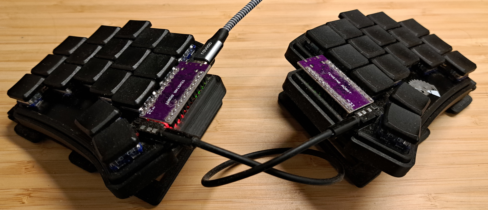
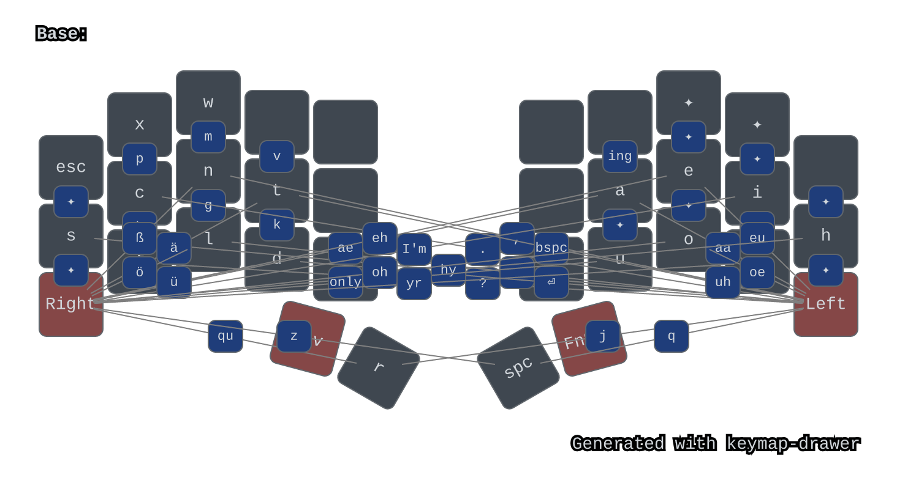
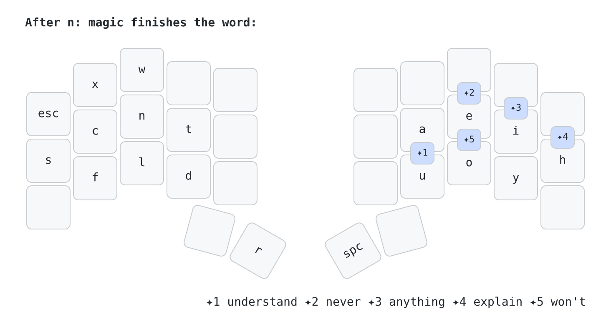
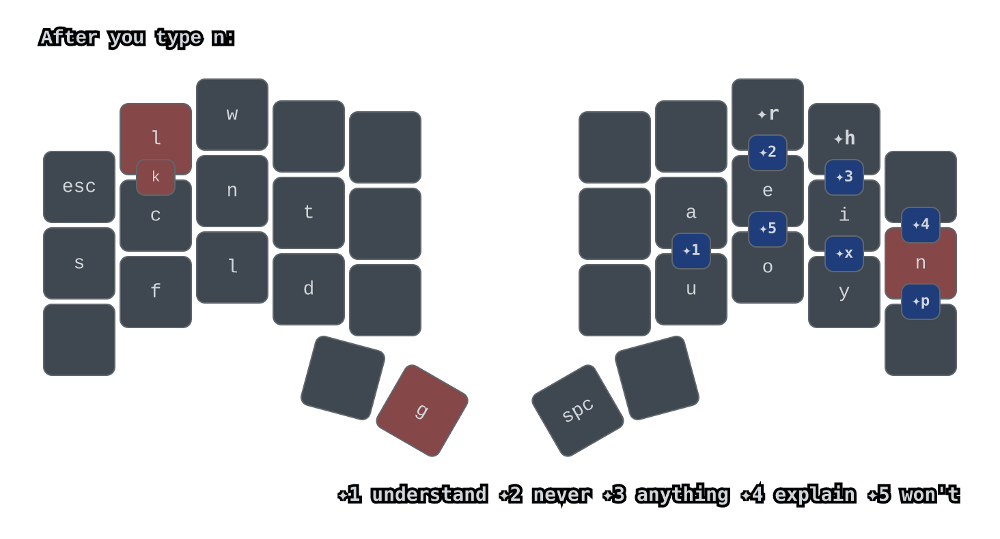
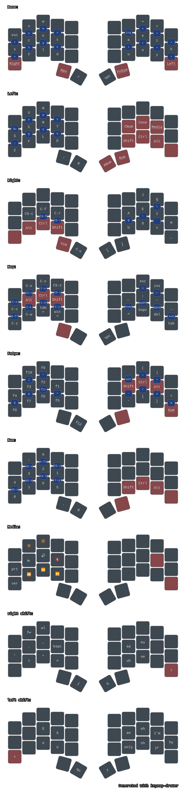
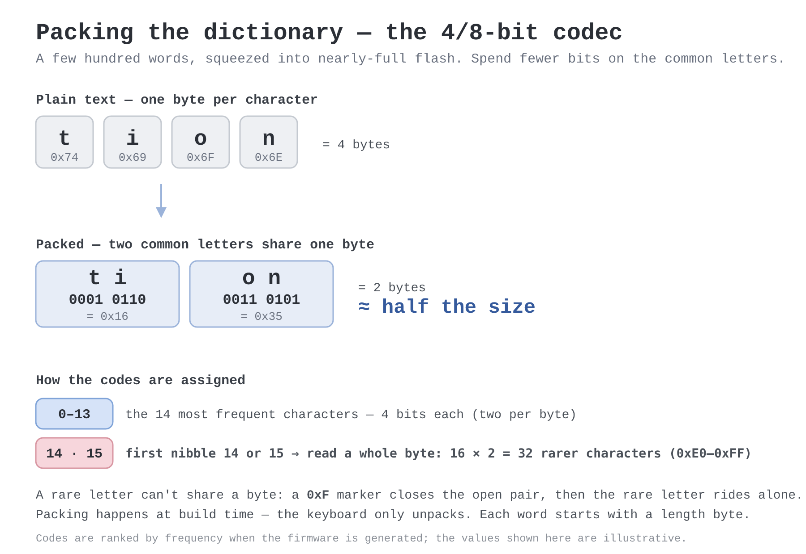

# The Secret World of Keyboard Wizardry

*I built a keyboard whose keys finish my words. Here's the rabbit hole that taught me how — and how
you'd start your own.*

> *Once upon a time there was a little wizard who was hopelessly obsessed with the ordinary world —
> and most of all with the clattering slab of plastic the outsiders spent their whole lives typing
> on. "It works fine," the other wizards shrugged. "Fine," the little wizard agreed. "But not
> perfect." And so — as wizards obsessed with the ordinary world tend to do — he set out to build the
> perfect keyboard.*

That was a few years ago. The wizard was me. The keyboard on my desk now has 34 keys whose letters
refuse to hold still — tap one and it becomes a different letter depending on what I typed a heartbeat
before; tap another and a whole word appears, "because", "didn't", "production", out of a single
press. It finishes my words before I do and rewrites my fumbles mid-keystroke, all from fewer than
half the keys under your hands right now. After three years I still catch myself grinning at it.

Why build a custom keyboard layout, you might ask? What an outsider's question.

Here's the thing I didn't expect when I started: you don't get from that clattering ordinary slab to a
keyboard like mine in one leap. You get there by *levels*. First you learn to even see what's wrong.
Then you learn to measure it. Then you build your own layout, and meet your first spell. Then you
start inventing spells of your own. Each level rewires your hands a little more than the last, and
you cannot rush them — every wizard who tries to jump straight to the deep magic just gets
overwhelmed and quits. It is, in other words, less a hobby than a little school of wizardry, with
years you pass through one at a time. Outsider, apprentice, adept, wizard, archmage.

So I won't lecture you on *why* — I'll walk you through the school. Think of this as its open-door
day: you get to climb every floor in one afternoon, no enrolling for years, all the way up to the
archmages who invent text-compression schemes to cram a whole dictionary into a sliver of keyboard
memory. (Yes, that's a real spell. Yes, I cast it. We'll get there.) Just remember the one rule of
the building — **you can't skip to the top floor.**

And though all of this is dressed up as the story of my keyboard, it's really the other way round:
the keyboard is just the worked example. The world is the point.

> **The curriculum — your Keyboard Wizard Level (KWL, pronounced "cool").** Every section is tagged
> with the level it belongs to, so you always know which floor of the school you're on:
>
> - **KWL 1 — Outsider.** You've never questioned Qwerty. We'll show you why it quietly fights your
>   hands all day.
> - **KWL 2 — Apprentice.** You learn to *see*: rolls, same-finger bigrams, lateral stretches — the
>   metrics that separate a good layout from a bad one.
> - **KWL 3 — Adept.** You meet your first *spell* — the humble repeat key — and watch it grow into
>   keys that finish your words for you.
> - **KWL 4 — Wizard.** You stop borrowing spells and start inventing them: tricks tuned to your own
>   hands, your own words, your own keyboard.
> - **KWL 5 — Archmage.** The deep (slightly unhinged) magic — like inventing a 4/8-bit encoding to
>   fit your word dictionary into a few kilobytes of keyboard memory.
>
> Follow the main story for the whole climb; the Appendix at the end is the restricted section, where
> the deeper KWL 4–5 spellbooks live.
>
> And watch for **✋ Try it** boxes — put your hands on whatever keyboard you have and *do* the
> motion. This school is felt in the fingers, not read on the page. The early boxes let you feel
> what's *wrong*; the later ones let you feel what each spell *wins*.

---

## Part 1 — The ground floor: why your keyboard fights you (KWL 1)

### What's wrong with Qwerty — KWL 1

Our first stop is the ground floor, where every outsider lives — myself included, for most of my life.
And the first thing they teach you here is that the keyboard you've used every day since childhood
was never designed for your hands.

You've probably heard that Qwerty was built to *slow typists down* and stop old typewriters from
jamming. It's a great story, and it's historically shaky. The fairer truth is gentler: Christopher
Sholes laid out Qwerty in the **1870s**, and it was simply the *first* arrangement that worked well
enough to win — a pioneering solution to a genuinely hard mechanical problem. Nobody was thinking
about your tendons. Why would they? They'd just invented the machine.

So the layout you inherited is a 150-year-old compromise that happens to fight your fingers in small
ways you've learned not to notice. Let me make you notice.

> **✋ Try it — feel what's wrong (on your normal Qwerty keyboard).** Each awkward motion has a name —
> don't bother memorising them (there's a glossary at the end), just *feel* each one as you type it
> slowly:
>
> - **Same-finger bigram (SFB)** — one finger hitting two keys in a row. Type "unjust" (`un`), then
>   "edited" (`ed`); feel the finger scramble up and down in place with no break.
> - **Same-finger skipgram (SFS)** — the same finger again, one key apart. Type "was": your ring
>   finger hits `w`, another finger takes `a`, then the *same* ring finger darts back for `s`.
> - **Lateral-stretch bigram (LSB)** — two adjacent fingers splayed sideways. Type "get" (`et`): your
>   index reaches inward for `t` while your middle stays on `e`, and the two fingers pull apart.
> - **Scissor** — one finger reaching up while its neighbor folds down. Type "scram" (`cr`), then
>   "seven" (`ve`); feel the awkward little tangle.

And now the opposite — because you have good motions too, you've just never noticed them either:

> **✋ Try it — feel what's *right*.** Type "we", then "er" — feel your fingers fire in sequence
> across one hand, each handing off to its neighbor. That's a **roll** — and an *in-roll*, toward the
> index, which is the comfiest kind. Now type "the", then "and" —
> feel your hands trade off, one resting while the other works. That's **alternation**. Those two
> motions are what a good layout is built from: no scrambling, splaying, or crossing — just flow.
> Qwerty hands them to you by accident, in a lucky handful of words; a good layout makes them the rule
> instead of the exception.

You've been fighting your keyboard for years and never knew any of it had a name. Now you've felt it —
and that *feeling*, far more than the vocabulary, is the whole reason the rest of this school exists.
(Upstairs, the apprentices learn to do something even better than name these motions: count them.)

### What's wrong with the keyboard *shape* — KWL 1

The letters are only half the problem. The other half is the slab itself.

A normal keyboard is one flat rectangle, so both your hands come at it from the same direction. To
reach it, your wrists bend inward and tilt up — and they hold that bent pose all day. That's the
posture that paves the road to carpal tunnel. There's also a subtler fossil hiding in plain sight:
the rows are offset diagonally — *row stagger* — which exists only because old typewriters needed
room for the levers underneath. Your fingers don't move diagonally. They're different lengths and
they curl straight toward your palm, which is what *column* stagger respects.

The fixes are things the ergonomic world already broadly agrees on, even outside wizard circles:
**split** the board so each hand sits at its own natural angle, **tent** it so your thumbs ride a
little higher than your pinkies, and **shrink** it so nothing is ever far from home.

That last one creates a delicious puzzle. Shrink the board far enough and you have fewer keys than
you have letters, symbols, numbers, and arrows to put on them. The way out is **layers**: like the
`Fn` key you already know, each physical key gets a second meaning when you hold a modifier. Tuck
that idea away — you'll meet it again higher up. That's the whole ground floor: you've now *felt*
everything that's wrong with the keyboard under your hands. The climb starts here.

---

## Part 2 — Apprentice years: learning to see, and my first layouts (KWL 2)

Down on the ground floor you *felt* the problems and learned their names. An apprentice's next move
is to stop trusting feel alone and start **counting**.

Every one of those motions can be measured. There's a whole cottage industry of layout analyzers that
take any arrangement of letters and hand you back the numbers: its same-finger-bigram percentage, its
rolls and alternation, its finger and hand load. "This feels nicer" becomes a figure you can chase,
compare and
optimize — and that's the moment you stop being an outsider. (Every term in this post is collected in the
**Glossary** near the end, if one ever trips you up.)

And then, of course, you start tinkering.

### The rabbit hole opens: the Ferris Sweep — KWL 2

My gateway drug was a **[Ferris Sweep](https://keebmaker.com/products/ferris-sweep)**, a 34-key
split. Thirty-four — my old keyboard had over a hundred. And I'd soon use even fewer: the two inner
columns were enough of a stretch that I dropped them, leaving effectively **14 keys per hand**.

*The actual board on my desk: a 34-key Ferris Sweep, split into two halves, each tented on a
3D-printed stand, wearing low-profile Choc switches. No number row, no function row — everything else
lives on layers.*

The physical setup turned out to matter as much as the letters. About 10° of tenting so each half
angles inward, a slight negative tilt so my wrists don't crane upward, and wrist rests so they don't
float. Get that geometry right and your hands complain far less than a flat slab ever let them — not
zero strain, but a different league.

One rabbit hole I'll happily signpost and *not* go down: designing and 3D-printing your own board.
That's a different madness, and this story is long enough.

### Finding a comfortable posture — KWL 2

The first surprise was *which* problems hurt most. I'd assumed the letters were everything; instead
the villains were **lateral stretch** and **pinky strain**. My hands hated reaching sideways, and
they hated overworking the weakest finger.

My fix was blunt, and as far as I know my own: **drop the inner columns entirely.** No inner column,
no sideways reach, lateral stretch all but gone. From
[Hands Down](https://sites.google.com/alanreiser.com/handsdown) I borrowed a posture idea — **curl
your hands as if resting on piano keys** instead of flattening them out. Much comfier, but it came
with a tax: in that curl, the top row became an awkward stretch for my pinky and index — though
that's partly down to my own finger lengths, and yours might reach there just fine — so I stopped
planning to use those two positions at all.

Do the arithmetic and the squeeze appears: no inner columns, no top row for two fingers a hand — I
no longer had even 26 comfortable keys, never mind room for shift, punctuation, and everything else.

What broke the logjam was **vertical combos**: press two stacked keys at once and get a third letter.
(This is real chording — pressing keys simultaneously for a single output. Stenographers do the same
trick for whole words; we'll meet them up on the magic floor.) Combos only work if pressing two keys
together is effortless and
never misfires, and that comes down to the switches: **Kailh Choc Light Blue ("gChoc"), 20-gram
linear** — feather-light and tightly spaced, no gap between caps. With those, combos felt natural,
and I could drop the obvious-but-clumsy alternative of spilling half my letters onto a second layer.

### First attempts at a layout — KWL 2

Building a layout is really two quests that barely overlap: the *letters*, and everything around
them — the layers of symbols, navigation, numbers and thumb keys. Like a lot of people, I started
from [Miryoku](https://github.com/manna-harbour/miryoku), a popular layer system for tiny keyboards.
(Despite the name, it isn't a letter layout: it ships with QWERTY and expects you to drop in whatever
letters you please. That tripped me up early on.) My board has drifted so far since that nothing of
Miryoku really survives in it now — but it was the doorway in. The letters were the other quest, and
the harder one.

And that one started somewhere genuinely unhinged. My first committed experiment, back in March 2023,
was eight keys in a row with the *whole alphabet split across four stacked layers* — the theory being
that if no letter sat more than a layer-tap away, my fingers would barely move. It was, predictably,
miserable to type on, and I dropped it fast. But the instinct behind it — minimize movement above
all else — is the thread running through everything I built afterwards.

From there came a run of real layouts. I typed on [**Canary**](https://github.com/Apsu/Canary) for a
while (before
[**Nerps**](https://www.reddit.com/r/KeyboardLayouts/comments/tpwyjc/sertain_nerts_nerps_low_redirect_low_sfb_low/),
I think), then settled on Nerps around April 2023, and over the following year worked through **Hands Down
Gold** to **Hands Down Vibranium**, where I live today. I lifted keymap tricks from
[**T-34**](https://www.jonashietala.se/blog/2021/06/03/the-t-34-keyboard-layout/) along the way.

> **🔍 Expert aside — why the base layout already beats Qwerty (safe to skip).** Before I added a
> single trick, Hands Down Vibranium was already a different world from Qwerty — and it's worth seeing
> *why*, because none of it is magic, just better placement:
>
> - **The common letters are on the home row.** `s c n t` under the left hand, `a e i h` under the
>   right — that's seven of English's eight most frequent letters sitting where your fingers already
>   rest. You barely leave home.
> - **Common chunks fall out as rolls.** "you" is three adjacent keys rolling inward (`y`→`o`→`u`); so
>   are `fl`, `nt`, `ld`. Whole pieces of English become one smooth finger-sweep instead of a scramble.
> - **`h` sits on the vowel hand's pinky** — and that's deliberate. `h` is almost always followed by a
>   vowel ("he" alone is ~1.7% of all bigrams; "ha", "hi", "ho" pile on more), and with the vowels
>   just inboard, every one of those becomes a clean inward roll: `he`, `ha`, `hi`, `ho` all sweep
>   from the pinky toward the index.
>
> The numbers bear it out — same analyzer, same English text, open it yourself on
> [Cyanophage](https://cyanophage.github.io/):
>
> | Metric *(lower is better unless noted)* | Hands Down Vibranium | QWERTY |
> | --------------------------------------- | :------------------: | :----: |
> | Same-finger bigram (SFB)                |      **0.57%**       | 4.39%  |
> | Same-finger skipgram (SFS)              |      **0.35%**       | 1.43%  |
> | Lateral-stretch bigram (LSB)            |      **0.36%**       | 4.55%  |
> | Scissor                                 |      **0.44%**       | 1.46%  |
> | Inward rolls *(higher is better)*       |       **34%**        |  22%   |
> | Outward rolls                           |         12%          |  19%   |
> | Alternation *(higher is better)*        |       **36%**        |  21%   |
>
> Vibranium wins every awkward-motion row — an SFB is about an eighth as likely as on Qwerty, a
> lateral stretch a twelfth — and it trades Qwerty's even roll split for a heavy *inward* lean (the
> comfy direction). All structural, no special keys.
>
> And 0.57% is just the *base*, before I add a single trick of my own. Everything from here on is
> gravy on an already-good layout.

If you want to *understand* this world rather than just watch me stumble through it, read
**[getreuer's guide to alternative layouts](https://getreuer.info/posts/keyboards/alt-layouts/)**. It
covers the metrics, the trade-offs, and the modern layouts far better than I can in a blog post
that's secretly about magic keys.

---

## Part 3 — The magic floor: keys that do more than one thing (KWL 3)

*My base layer. The home row is `s c n t` / `a e i h`; every `✦` is a magic key, and the blue badges
are combos (two keys pressed at once for a third). The rare letters `j`, `q`, `z` and the German
`ä`, `ö`, `ü`, `ß` don't earn a base-layer spot — they live in *directional combos* with the two
pinky "diamond" keys (the `*Left` / `*Right` layer holds), pressed last. This diagram is generated
straight from the layout with [keymap-drawer](https://github.com/caksoylar/keymap-drawer) — more on
that in the appendix.*

One detail worth a second look: see where `r` sits — on the **thumb**, not a finger. That's a fairly
recent move in layout design, the *alpha thumb*, and it's increasingly regarded as a step forward.
Your thumbs are strong and, on an ordinary keyboard, almost wasted — they only ever hit the space
bar. Promote one to a real letter and you've effectively added a ninth finger to the rotation, which
means fewer same-finger bigrams for the other eight to absorb. (It's also why `n`+`r` rolls so
cleanly when we get to adaptives: that pair is a finger and a thumb, never one finger fired twice.)

### Whoa #1: Magic Keys — KWL 3

Every magic key on my board grew from one idea in getreuer's writing: **[Magic
Sturdy](https://getreuer.info/posts/keyboards/alt-layouts/#magic-sturdy)**. Getreuer had taken a
humble QMK primitive he'd built — the *alternate-repeat key*, which guesses the most useful key to
follow whatever you just pressed — and tuned it for the Sturdy layout into a single "magic" key. Tap
it after a space and it types "the "; after `m`, "ent"; after `t`, "ion". One key, no fixed letter,
pure context. The first time I saw it, something clicked.

I became slightly obsessed. If one key could read the previous keystroke and pick a smart
follow-up, why stop at the handful getreuer shipped? I kept adding cases — after *this* key, do
*that* — until that single borrowed key had grown into a lookup table with a column of its own. At
some point it stopped being "Magic Sturdy, ported" and became its own beast. I renamed it
**magic**, and I now have eleven of them.

> **Short detour: stenography.** Court stenographers — the people transcribing a trial in real
> time — hit 200 words a minute and beyond. They don't type letters; they *chord*: press a handful
> of keys at once for a whole syllable or word, which a dictionary expands into text. It's the
> fastest anyone types by hand. Magic keys are that idea shrunk to fit a normal keyboard: a tiny,
> hand-picked dictionary that turns a keystroke or two into a word.

Because that's where it went. Once a key can read what came before it, you don't stop at single
letters — you expand whole words. Type `d`, tap magic, and out comes "didn't ". Type `t`, tap magic,
and you get "just " — and watch closely, because it *deletes the `t` first*. The keyboard saw where
I was going and rewrote what I'd already typed.

*Just one slice of the table: five of the magic keys that fire after `n` — the ones that finish a
whole word. Each `✦` is a magic key (nearly all are combos — two keys at once); the legend shows the
word. Every other letter has its own row of expansions.*

> **✋ Try it — feel the win.** On your keyboard, type "the " — that's *four* keystrokes (t, h, e,
> space). Now type "ing" — three more. Common little chunks,
> paid for over and over, all day. On my board, `ing` is a single **combo** (two keys at once), and
> "the " is one magic tap (space + magic). Count how many times you'd type "the", "and", "ing", "tion" in this
> paragraph alone, then multiply by a career.

The honest catch: there is no free lunch in muscle memory. Eleven magic keys, each meaning something
different depending on the letter before it, is a *lot* to hold in your fingers. I wrote myself a
little Python trainer and drilled them like flashcards. Months later I still rediscover ones I set
up and forgot. But the ones that stuck, stuck deep — I don't think "magic key" anymore, I think the
word, and it appears.

### Whoa #2: Adaptive Keys — KWL 3

Magic keys have a cost you can't optimize away: nearly all of them are *combos* — two keys pressed at
once — and a combo, however light, is always a touch more effort and a touch less certain than a
single real key. (You have to learn each one, sure — but as you'll see, the alternative needs
learning just as much, so that's a wash.) The real prize is getting a common sequence onto **ordinary keys** instead of
spending a combo on it.

So here's the question I kept circling: could the keyboard fix the awkward stuff using the plain keys
I'm *already pressing*?

That's an **adaptive key** — a term I'm borrowing straight from
**[Hands Down](https://sites.google.com/alanreiser.com/handsdown#h.3fq4ywspvw1g)**, which defines
them as keys that "alter the characters sent based on the sequence and speed of keys typed to
eliminate awkward fingering sequences." Mine lean on the *sequence* alone, though — never the speed. I
avoid timing-sensitive tricks on principle (it's the same reason I never adopted home-row mods), so an
adaptive fires purely on *which* keys you press, not how fast. Where a magic key is a combo you reach
for, an adaptive rides on two ordinary keystrokes: type a certain pair and it quietly rewrites the
output. No combo, no special key — just normal typing that comes out better than you typed it.

Let me show you the one that converted me. On my layout, `n` and `g` live on the same finger. If you
know anything about layouts, that should make you wince — the `n` and `g` of "song", "long", "finger"
landing on one finger is a beginner mistake, a same-finger bigram waiting to happen on every other
word.

It's not a mistake. It's bait.

Because I never actually type `n` then `g`. I type `n` then `r` — a finger then the thumb (remember,
`r` is the alpha thumb), a clean little roll — and the adaptive emits "ng". The same-finger collision I
designed *into* the layout never fires. I get to put `g` somewhere comfortable precisely *because* the
adaptive guarantees I'll
never reach for it the hard way.

The same trick handles doubled letters. Type `l`, then `r`, and out comes "ll". Same `r` key, mind
you — it just reads what you typed before it: `r` after `l` is "ll", `r` after `n` is "ng". (The
diagram further down shows the full `n` case; every other letter has its own.)

> **✋ Try it — feel the win.** Remember the same-finger ache from the very first box? Type "ll" on
> Qwerty right now: that's your ring finger, hammered twice in the same spot. Now type a quick
> two-finger roll instead — "lk", or "po" — one finger, then its neighbor. Feel how the roll *flows*
> where the double *stutters*. That's the difference, on every "ll" I type, forever.

This was the genuinely surprising part. I expected adaptives to be a clever space-saving hack. I
didn't expect rolling two fingers to feel *better* than pressing one finger twice — but it does,
every time, and now a plain doubled letter feels slow to me.

There's no free lunch, of course. The `r` key is now "spoken for" after certain letters, so on the
rare occasion I genuinely want a literal "lr", I fall back to a magic key — a reflex I'm honestly
still building. But "lr" is vanishingly rare and "ll" and "ng" are everywhere. The whole layout is
one long bet on what you *actually* type: make the common motions effortless, and let the rare ones
pay a small toll.

Here's the whole bet in one picture — everything the *next* press can do once you've typed `n`:

*Pink keys are **adaptives** rewriting ordinary keys: after `n`, pressing `x`/`h`/`r`/`p` quietly
emits `l`/`n`/`g`/`k` (so you get "nl", "nn", "ng", "nk" as clean rolls — `p` is itself a combo, so
its rewrite shows as the pink `k` badge). The `✦` badges are **magic** keys. And here's the trick
that makes it safe: the adaptives eat `r`, `h`, `x`, `p` after `n` — so `✦r`, `✦h`, `✦x`, `✦p` hand
those exact letters straight back. Nothing becomes unreachable; the common case just gets cheaper.
The numbered `✦` keys finish whole words (see the legend).*

---

## Part 4 — Graduation: was it worth it?

Time for the honest accounting — the part where I try hard not to sell you anything.

### The honest scorecard — KWL 1

**Speed?** Not the headline reason — and not really what a layout is for. Raw speed is mostly
*practice*: plenty of blazing-fast typists run Qwerty, and the genuinely fastest people alive use
stenotype machines, not a cleverer arrangement of letters. What a good layout buys you isn't speed,
it's **headroom** — with the same-finger collisions and awkward stretches designed out, the layout
stops being the thing that caps you. I keep getting slowly faster and haven't hit a ceiling yet — but
that's the layout staying out of the way, not pushing. It won't make you fast on its own; it just
won't hold you back.

**And the elephant in the room — why not just talk to your computer?** Fair question. If all you want
is words on a screen as fast as possible, dictation and AI transcription now beat every keyboard,
mine included. That's exactly *why* this is a niche. A custom layout was never really about
throughput — it's about the things voice is bad at: code and symbols, surgical editing, working in a
silent room, not narrating your password to a cloud. And, honestly, about the plain joy of the craft.

So what *did* I get? **Comfort — every single day.** It's hard to reduce to one number, but the wins
are concrete. My hands move a fraction of what they used to. I reach the arrow keys without leaving
the home row, and arrows-with-modifiers without leaving it either — give that a month and you'll
never want it taken away. Common chunks of English like "the", "and", and "ing" cost a tap or two
instead of a little finger-journey. Doubled letters roll off two fingers instead of hammering one.

And the same-finger stutter — that one finger scrambling up and down in place — is **essentially
gone**. Two things did it: the base layout barely has it to begin with (Vibranium's 0.57% next to
Qwerty's ~4.4%, from the table in Part 2), and the adaptives clean up the few collisions I built in on
purpose, like `n`/`g`. I almost never feel one.

The cost? **Time, and plenty of it.** This took years, and I'm still learning the deep end. You can't
justify that on a stopwatch. You justify it the way you justify any craft: because the doing of it is
worth something to you.

### So should *you* do it? — KWL 1

Yes — with your ambition scaled honestly, because "build a custom keyboard" hides a dozen separate
decisions of wildly different value.

The easy, near-universal win is a **split keyboard with light, low-profile switches**. Better wrist
angle, less travel, less strain — most people who try one don't go back, and you don't have to learn
anything new to feel the benefit.

A **custom letter layout** is a much fuzzier call. Even a well-trodden one like Dvorak takes months
to relearn, and the payoff is comfort, not speed. If you go for it, **don't copy mine** — start from
a modern, well-optimized layout.

And watch for the real trap, the one that nearly got me: **analysis paralysis.** This hobby will
happily let you spend months comparing metric tables and never actually learn a layout. Resist it.
The top contenders trade the crown every year — which is exactly the tell that the differences
between them are tiny, certainly next to the gulf between any of them and Qwerty. So the worst move
is to keep choosing. Pick one and commit; if you just want a name so you can stop deliberating, take
**[enthium](https://github.com/sunaku/enthium)** and go.

And if you do catch the bug, two rules. First, the one from the front door: **you can't skip to the
top floor.** Don't try every idea in this post at once. Find the level just above where you are,
climb one step, and let it go automatic before you reach for the next. Second: **be patient, and pick
the fun part first.** A new layout alone takes a couple of months of daily practice; no layout is
perfect, since it's a balancing act of competing trade-offs and the right balance is personal. A
drill ladder that works (getreuer's, with one addition of mine): draw the layout from memory until
you can picture it; warm up on [keybr.com](https://www.keybr.com), which feeds you letters gradually;
then build real muscle memory with [Monkeytype](https://monkeytype.com) and — the one that really
wired my brain — [ngram-type](https://ranelpadon.github.io/ngram-type/), which drills the common
letter-pairs and words to automaticity. Keep stop-on-error on and chase accuracy, not speed.

One place I'd ignore the usual advice: **don't drag it out.** The common tip — practice on the side,
keep your old layout for real work — sounds gentle, but it just stretches the painful beginner phase
until your patience runs dry. Switch over for real fairly soon and push through the slow couple of
weeks; it's shorter that way, and committing is the thing that actually builds speed.

Because the goal here was never for you to copy my keyboard. It's for you to want to build your own.

That's the tour. You've seen every floor — from the ordinary slab that fights your hands to the
archmage tricks that fold a dictionary into a few kilobytes. If your fingers are itching by now,
good: that's how it started for me, too.

> *And the little wizard, of course, never did finish the perfect keyboard. There was always one
> more awkward bigram to banish, one more spell to teach a key. But he kept happily tinkering ever
> after — because the perfect keyboard, like all the best quests, was never really the point. The
> climb was.*

So here's your choice. Everything up to now has been KWL 1 to 3 — the why, the craft, the working
magic. You could stop here with the whole story and go build *something*; no shame in it.

Or you could climb the last two floors. **KWL 4–5 is the restricted section**, where I stop
explaining the magic and start showing the wiring: how the layers fit together, how magic and
adaptive keys actually work in the firmware, and the gloriously unhinged dictionary-compression trick
that crams it all onto the board. And if you'd rather *build* than read, the **further-reading** list
at the very end is the toolkit — layouts, trainers, analyzers, communities — I wish I'd had on day
one. (The **glossary** comes first, for anything that tripped you up.)

---

## Glossary

A few words this post leans on. The slippery one is **"layout"**, which keyboard folk use for three
different things — I try to keep them straight:

- **Letter layout** — the *arrangement of letters* (Qwerty, Dvorak, Colemak, Hands Down). When
  someone says "I switched layouts," this is usually what they mean.
- **Keymap** (or *full layout*) — *everything* the keyboard does: the letter layout plus all the
  layers, combos, magic and adaptive keys, and thumb keys. This is what I actually built, and what a
  site like [keymapdb](https://keymapdb.com/) catalogs.
- **Physical layout** (or *form factor*) — the *shape* of the keys: split or not, column vs row
  stagger, how many keys.

The motions an apprentice learns to count:

- **Same-finger bigram (SFB)** — two keys in a row typed by one finger. Cramped and slow; minimize.
- **Same-finger skipgram (SFS)** — the same finger again, one key apart.
- **Lateral-stretch bigram (LSB)** — two adjacent fingers pulled sideways to reach.
- **Scissor** — one finger reaching up while a neighbor folds down.
- **Roll** — fingers firing in sequence across one hand. An **in-roll** runs toward the index, an
  **out-roll** toward the pinky; in-rolls generally feel better, and layouts like Hands Down
  deliberately favor them. **Alternation** — the hands taking turns. All good; maximize. (For
  rigorous definitions of all of these, see getreuer's
  [glossary](https://getreuer.info/posts/keyboards/glossary/).)
- **Finger & hand load** — how typing is spread across the fingers and the two hands. A good layout
  keeps the weak pinkies light and the two hands roughly balanced.

The machinery:

- **Layer** — a second meaning for every key, reached by holding a key (like `Fn`).
- **Combo** — pressing two keys at once for a third output (a *chord*, in steno terms).
- **Home-row mod (HRM)** — a home-row key that's a letter on tap and a modifier on hold.
- **Magic key** — a key whose output depends on the key you pressed *before* it.
- **Adaptive key** — a letter pair that rewrites itself automatically into a comfier motion.
- **Tenting** — angling the two halves so the thumbs ride higher than the pinkies.

---

## Appendix — the restricted section (KWL 4–5 spellbooks)

> Welcome to the restricted section. Everything from here is KWL 4–5 — the mechanics behind the
> magic, for readers who want to *build* something like this, not just read about it. If it's more
> than you wanted, don't worry: you've already seen the whole school. This is just the spellbook.

### The world of alternative layouts — KWL 4

Custom layouts have a family tree. Qwerty begat Dvorak, Dvorak's ideas fed Colemak, Colemak begat
Colemak-DH, and the last few years brought a wave of optimizer-designed layouts — Gallium, Graphite,
Sturdy, Canary, Nerps, the Hands Down family, enthium. If those names mean nothing to you yet,
[getreuer's guide](https://getreuer.info/posts/keyboards/alt-layouts/) profiles them all; they're
argued over daily in the
[AKL (Alternate Keyboard Layouts) Discord](https://discord.gg/keyboard-layouts). There's no consensus
"best" — a handful of contenders trade the crown every year. getreuer currently steers newcomers to
Gallium; I landed on Hands Down Vibranium (my own wandering path through it is back in Part 2); if I
were starting clean today I'd look hard at [enthium](https://github.com/sunaku/enthium).

The resources at the bottom of this post are the rest of the map I wish I'd had on day one.

### How big the magic table actually got — KWL 4

The eleven magic keys aren't eleven tricks. Each one — only two are plain keys, the other nine are
combos — emits something different depending on the key you pressed just before it. So the capacity
is a multiplication: eleven keys × the twenty-six letters that might precede them (twenty-seven with
space) is **room for getting on for three hundred distinct expansions**, all from a tiny handful of
physical positions. (In the source it's literally that table: a row per preceding key, a column per
magic key. I've filled a bit over half of it so far.) A "chord" in my world is therefore just two
keys: a letter, then a magic key — `b` + magic → "because", `t` + magic → "tion", `k` + magic →
"update".

They also chain. Once a word fires, the next magic press appends a suffix — `-ed`, `-ly`, `-s`,
`-n't`, `-ing` — so `k` + magic → "update", then magic again → "updated". A separate **Cycle** table
does the same for related forms rather than endings: press again and "know" steps to "knowledge", or
"worse" to "worst". This is the long tail I'm still learning. The whole thing lives in the `Magic
Keys` and `Cycle` tables in the [repo README](https://github.com/zeitlinger/keyboard), the single
source of truth the firmware is generated from.

### QMK — the firmware — KWL 4

All of this runs on [QMK](https://docs.qmk.fm/), the open-source firmware for programmable keyboards.
It does far more than ZMK and the rest, but it's also low-level C, and once I went past the basics —
combos, magic keys, adaptives, a dozen layers — hand-writing the keymap became unmanageable. So I do
the slightly unusual thing this whole post has been hinting at: I **generate the firmware from the
markdown tables in my README**. The README *is* the layout; a Kotlin generator turns it into QMK
code. Edit a table, regenerate, flash.

### Hands Down Vibranium — KWL 4

My base letter layout is a variant of
[Hands Down](https://sites.google.com/alanreiser.com/handsdown) called Vibranium, chosen for its
strong same-finger and scissor numbers and its bias toward comfortable in-rolls (rolling toward the
index finger). I adapted it to my constraints —
dropping the inner columns, then shuffling a few letters to dodge the uncomfortable positions the
posture phase had already ruled out. The base layer's home row settles into `s c n t` on the left and
`a e i h` on the right. The bottom row is prime real estate too — in the piano curl, curling a finger
down is easy — so it carries common letters as well; the rarer ones live up on the top-row stretch and
on combos.

### Layer design — KWL 5

A 34-key board lives or dies by its layers. The one firm rule I follow: **no home-row mods on the
base layer.** Home-row mods — where a key is a letter on tap and a modifier on hold (see
[precondition's guide](https://precondition.github.io/home-row-mods) for the full rundown) — are too
timing-sensitive for fast prose; you end up with spurious Ctrls mid-word. People do tame them with
tricks like getreuer's [Achordion](https://getreuer.info/posts/keyboards/achordion/), but I'd rather
sidestep the timing problem entirely: I keep dedicated shift keys on the lower pinkies — one on each
hand, just like the left and right shift on a traditional keyboard. Hold one and the lower row exposes
the other modifiers, right next to the finger that triggered them. Modifiers only sit on the home row on the *other* layers,
and there it's harmless: those keys aren't doubling as letters, so there's no tap-versus-hold guess to
get wrong in the first place.

Underneath that, four layers do the real work — base, navigation, function/symbol, and a number layer
you reach by holding function/symbol and right-shift together. Both are right-hand keys, so the right hand holds
the layer open while the left taps out the numbers. A few special-purpose layers handle media keys,
case conversion, and the shift behavior above.

*The four working layers, top to bottom. **Base** is the letters. **Nav** puts arrows and editing
under the right hand (held from the left), with window/tab switching and editor shortcuts on the
left. **FnSym** carries the function keys and symbols. **Num** is a numpad under the left hand,
reached by holding two right-hand keys — so the hand typing the digits never has to move. Pink keys
are the held/activation keys for each layer; blue badges are combos. (The repo's `keymap.svg`
renders every layer, media and case included, in one go — generated straight from the layout.)*

The dedicated shift keys from earlier each open their own layer: **Left** (held with the right
pinky) puts capitals and combo-letters on the left hand; **Right** mirrors it for the right hand.
The opposite hand's bottom row turns into the other modifiers — Ctrl, Alt, Gui — so a one-handed
chord like Shift+Alt+x is reachable without contorting. There's a wrinkle, though: the moment any
of those other modifiers is held, the letters drop back to lowercase. Otherwise the only thing the
shift layer could ever emit would be `A-X`, never `A-x` — and you'd have no way to type the
unshifted modified key. Keeping the letters lowercase under a held modifier means `A-x` is the
default; `AS-x` is what you get by *also* holding the original shift on top.

### Magic keys — implementation — KWL 5

Mechanically, it's all custom code — the alternate-repeat key was the *inspiration*, not the
implementation. On each magic press the firmware looks at the last keycode and dispatches from a
generated lookup — tap a letter, emit a word; tap again, chain a suffix.

The hard part is *space*. The whole firmware has to fit the atmega32u4's flash — about 28 KB once the
bootloader takes its cut — and mine fills it to the brim: 94%, with only ~1.5 KB to spare. A couple
hundred words and phrases stored as plain text — a byte per character — would push it over. But
written English is lopsided: the fourteen most common characters do most of the work. So I gave them
a **4-bit code** and left everything else at 8 bits, packing two common letters into the
space a single character would normally take. The compression itself runs at build time, in the
Kotlin generator that writes the firmware; the keyboard just carries the squeezed-down dictionary and
*unpacks* it on the fly. It's a tiny, hand-rolled codec that roughly halves the dictionary — just
enough to keep the firmware under the line. *That's* the archmage
spell I teased at the front door: not glamorous, exactly, but there is something gloriously unhinged
about writing a bespoke compression scheme to claw back a few hundred bytes of flash. I'd
do it again tomorrow.

*The codec in one picture: the 14 most common characters get a 4-bit code and pack two-to-a-byte;
rarer characters keep a full 8-bit code. Two common letters in the space of one — roughly halving the
dictionary so the firmware still fits in flash.*

### Adaptive keys — implementation — KWL 5

Adaptives are the mirror image of magic keys. A magic key waits for its own deliberate press; an
adaptive fires automatically when a specific *pair* of keys is typed, rewriting the second key's
output (`n` then `r` → "ng"). In firmware that means intercepting the keypress early, checking the
remembered previous key, and substituting. Which pairs earn an adaptive is a frequency calculation:
the bigram has to be common enough to be worth "spending" the second key on, and the displaced
literal — the rare `lr`, say — gets a magic-key escape so it's still typable. The full set lives in
the `Adaptives` table in the repo.

## Further reading & the community

If this gave you the itch, here's where to scratch it.

### Read this first

- [getreuer's keyboard tour](https://getreuer.info/posts/keyboards/tour/index.html) — a friendly
  intro to split keyboards and what makes them comfortable. Start here if the hardware is new to you.
- [getreuer's guide to alternative layouts](https://getreuer.info/posts/keyboards/alt-layouts/) — the
  single best introduction to the *letters*, plus its
  [glossary](https://getreuer.info/posts/keyboards/glossary/) for the metrics.

### Theory

- [The Keyboard Layouts Doc](https://docs.google.com/document/d/1W0jhfqJI2ueJ2FNseR4YAFpNfsUM-_FlREHbpNGmC2o)
  — deep, exhaustive typing and layout theory.
- [Dreymar's Big Bag](https://dreymar.colemak.org/) — mods and tricks.

### Trainers — learn and drill

- [keybr.com](https://www.keybr.com) — adaptive lessons that build touch-typing from zero.
- [Monkeytype](https://monkeytype.com) — speed and accuracy testing once your fingers know the layout.
- [ngram-type](https://ranelpadon.github.io/ngram-type/) — drill the most common bigrams, trigrams,
  and words until they're reflex.
- [gfruit's words filter](https://gfruit.github.io/typing/words-filter.html) — generate practice text
  loaded with specific bigrams, characters, or fingers, to drill a layout's weak spots.

### Analyzers — score a set of letters

- [oxeylyzer](https://github.com/O-X-E-Y/oxeylyzer) — a fast analyzer you run locally.
- [Tanamr's spreadsheet](https://docs.google.com/spreadsheets/d/1yBwRpn3Gkp8qHje_cwDj6tcZ2ReqC9rfvsioXzt1xdg)
  — the full zoo of analyzers, if you want to go deeper.

### Layout lists — browse what others have built

- [keymapdb](https://keymapdb.com/) — complete *keymaps* (layers, combos, magic — not just the
  letters) to mine for ideas.
- [Keyboard layout wiki](https://layouts.wiki/) — the friendly on-ramp, and a catalog of letter
  layouts with write-ups.
- [Cyanophage](https://cyanophage.github.io/) — popular layouts side by side, with their stats.

### Community

- [AKL (Alternate Keyboard Layouts) Discord](https://discord.gg/keyboard-layouts) — the main hub,
  with channels for Colemak, Dvorak, Monkeytype and more.
- [Hands Down Discord](https://discord.gg/xwTMKZEy) — the Hands Down family has its own server.
- **Questions about my layout?** I'm on both the AKL and Hands Down Discords as `@gregor.zeitlinger`
  — say hi.

### My layout

- Tables, generator and firmware: [github.com/zeitlinger/keyboard](https://github.com/zeitlinger/keyboard).
