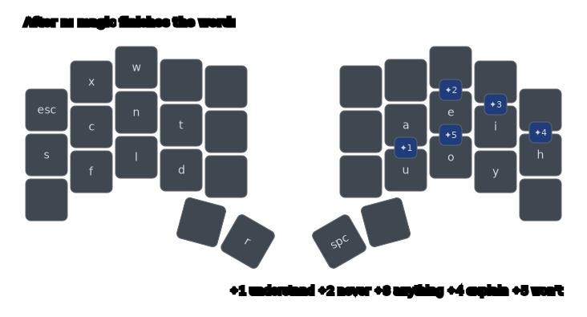
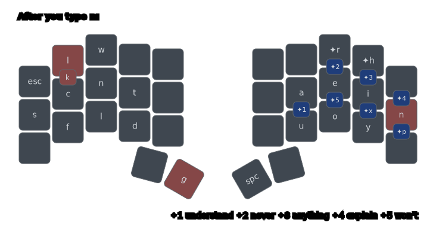
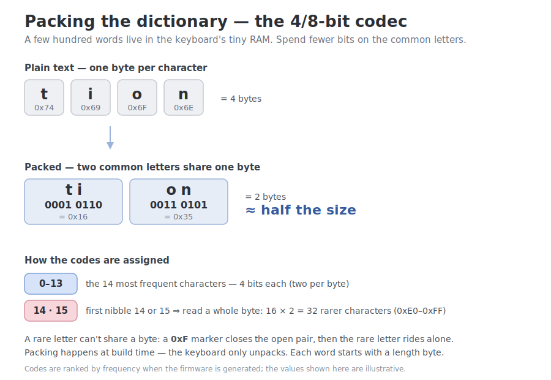

# Blog

Source and assets for the blog post
[**The Secret World of Keyboard Wizardry**](2026-06-13-magic-keyboard.md): the Markdown, the images
it embeds (under [`images/`](images/)), and the Cyanophage stats it cites (`key-stats.txt`).

## Diagrams

[`../keymap.svg`](../keymap.svg) is the full, generated layout (the blog embeds it as
[`images/layers.png`](images/layers.png)). Alongside it I keep a few hand-authored, stripped-down
diagrams here — they teach one idea at a time instead of showing everything at once. They use
keymap-drawer's
[YAML input format](https://github.com/caksoylar/keymap-drawer#keymap-yaml-specification) directly
(positions and labels written by hand, not derived from the layout tables), so they can highlight
just the keys that matter and drop the rest. `mise run generate` re-renders each one and converts it
to a 2× PNG under [`images/`](images/).

- **`base-layer.svg`** — just the Base layer, rendered straight from `qmk/keymap.yaml` with
  `keymap draw -s Base`. The post's first look at the layout.

The next two show what the *next* press does right after you type `n`:

- **[`magic-words.yaml`](magic-words.yaml)** — only the magic keys that complete a whole word
  (`✦1` understand, `✦2` never, …).

  

- **[`after-n.yaml`](after-n.yaml)** — the full picture: pink keys are adaptives rewriting ordinary
  keys (`x`/`h`/`r`/`p` → `l`/`n`/`g`/`k`; `p` is a combo, so it shows as the pink `k` badge), and the
  `✦` badges are magic keys. The single-letter magics (`✦r ✦h ✦x ✦p`) hand back the very letters the
  adaptives consume after `n`, so nothing becomes unreachable.

  

- **[`codec.svg`](codec.svg)** — how the magic dictionary is packed to fit flash: the 14 most frequent
  characters get a 4-bit code (two per byte), while a leading nibble of 14 or 15 escapes to a full
  8-bit code (`0xE0`–`0xFF`, 32 slots), so the table roughly halves. See
  [`StringEncoding.kt`](../src/main/kotlin/StringEncoding.kt) for the implementation. This one is a
  hand-drawn SVG, not keymap-drawer output, so `mise run generate` only converts it to PNG (it never
  re-renders the SVG itself).

  
